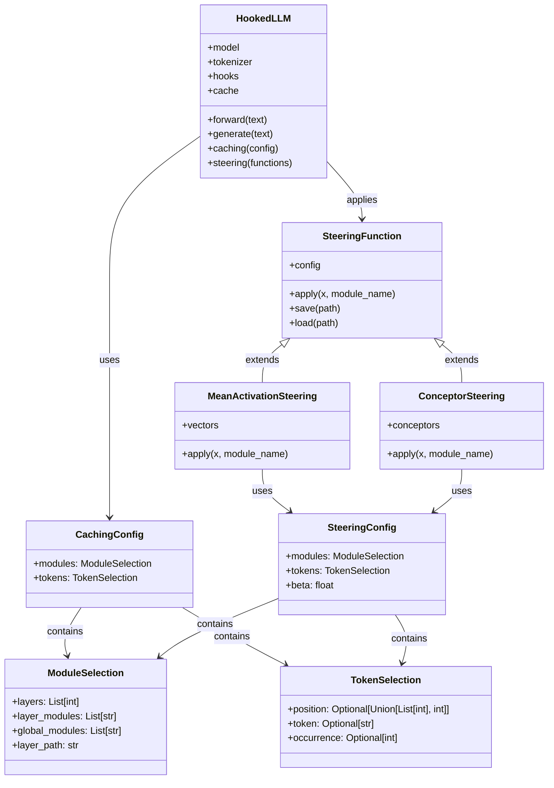
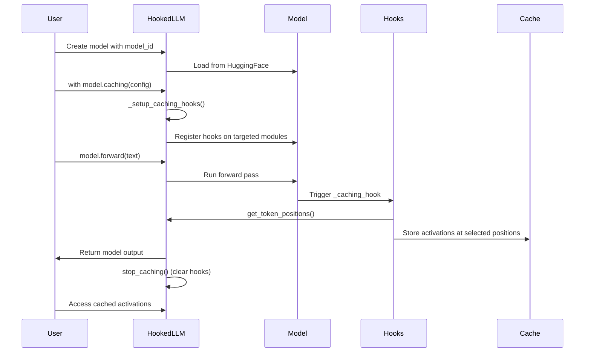
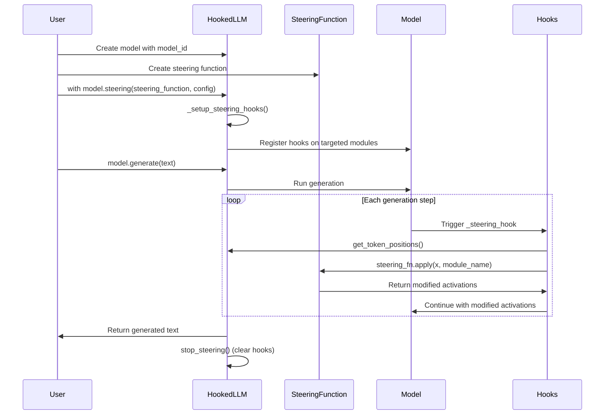

# HookedLLM

A lightweight, flexible library for extracting activations from language models and applying steering techniques to modify their behavior.

## Overview

HookedLLM provides a simple framework for:

1. Extracting activations from specific layers and token positions
2. Applying steering functions to modify the behavior of the model
3. Analyzing and manipulating the internal representations of language models

The library is designed to be simple and easy to use, making it ideal for both research and educational purposes.

## Installation

Clone the repository

```bash
git clone https://github.com/stevenabreu7/conceptor-llm.git
cd conceptor-llm
```

***Make sure to use Python 3.10***

The recommended way to install this repository is with [uv](https://github.com/astral-sh/uv). This handles virtual environment and dependencies much faster than `venv` and `pip`. Installing dependencies (without downloading) takes only <200ms compared to around ~2min with `pip`.

Installing this package and all dependencies can be done with one command in `uv`:

```bash
uv sync
```

Then run all python scripts using `uv run python script.py`.

Alternatively, you can also use `venv` and `pip`:

```bash
python -m venv .venv
source .venv/bin/activate
pip install -e .
```

### Optional dependencies

To install transformer_lens (e.g., to run the tests in the `examples` folder that compare HookedLLM to transformer_lens):
```bash
uv pip install transformer_lens
# or just: `pip install transformer_lens`
```

To install `lm-eval-harness`:
```bash
uv pip install lm_eval
# or just: `pip install lm_eval`
```

## Quick Start

Basic usage:

```python
from hookedllm.HookedLLM import HookedLLM

# Initialize a model
model = HookedLLM("gpt2")

# Run a forward pass
outputs = model.forward("Hello, world!")

# Generate text
generated = model.generate("Once upon a time", generation_kwargs={"max_length": 50})
decoded = model.tokenizer.decode(generated[0])
print(decoded)
```

The typical control flow is to (1) cache activations, (2) compute a steering function, and (3) apply the steering function during inference:

```python
from hookedllm.HookedLLM import HookedLLM
from hookedllm.config import CachingConfig, ModuleSelection, TokenSelection
from hookedllm.config import MeanActivationConfig
from hookedllm.steering_functions import MeanActivationSteering

# Initialize a model
model = HookedLLM("gpt2")

# (1) Extract activations for a specific concept
caching_config = CachingConfig(
    modules=ModuleSelection(
        layers=[11],
        layer_modules=["ln_1"],
        layer_path="transformer.h",
    ),
    tokens=TokenSelection(position=-1),
)

# Collect activations for positive examples
with model.caching(caching_config):
    model.forward("I love this movie. It's great!")
    model.forward("The experience was amazing!")

# Get the cached activations
positive_activations = model.get_and_clear_cache()

# (2) Create a steering function
steering_config = MeanActivationConfig(
    modules=ModuleSelection(
        layers=[11],
        layer_modules=["ln_1"],
        layer_path="transformer.h",
    ),
    tokens=TokenSelection(position=-1),
    beta=2.0,  # Steering strength
)

steering_fn = MeanActivationSteering(
    config=steering_config,
    activations=positive_activations,
)

# (3) Apply steering during generation
with model.steering(steering_fn, steering_config):
    output = model.generate(
        "This movie was",
        generation_kwargs={"max_length": 30}
    )
    print(model.tokenizer.decode(output[0]))
```

## Supported Steering Methods

### Mean Activation Vectors

```python
from hookedllm.config import MeanActivationConfig
from hookedllm.steering_functions import MeanActivationSteering

# Create a steering function with mean activations
steering_config = MeanActivationConfig(
    modules=ModuleSelection(
        layers=[11],
        layer_modules=["ln_1"],
        layer_path="transformer.h",
    ),
    tokens=TokenSelection(position=-1),
    beta=2.0,
)

steering_fn = MeanActivationSteering(
    config=steering_config,
    activations=activations,
)
```

### Conceptors

```python
from hookedllm.config import ConceptorConfig
from hookedllm.steering_functions import ConceptorSteering

# Create a conceptor steering function
conceptor_config = ConceptorConfig(
    modules=ModuleSelection(
        layers=[11],
        layer_modules=["ln_1"],
        layer_path="transformer.h",
    ),
    tokens=TokenSelection(position=-1),
    beta=1.0,
    aperture=10.0,  # Regularization parameter
    additive=True,  # Whether to use additive conceptor steering
)

conceptor_steering = ConceptorSteering(
    config=conceptor_config,
    activations=concept_activations,
)
```

## Activation Caching

```python
from hookedllm.HookedLLM import HookedLLM
from hookedllm.config import CachingConfig, ModuleSelection, TokenSelection

# Initialize a model
model = HookedLLM("gpt2")

# Configure caching
caching_config = CachingConfig(
    modules=ModuleSelection(
        layers=[11],  # Target layer 11
        layer_modules=["ln_1"],  # Target the input to the layer norm
        layer_path="transformer.h",  # Path to the transformer layers
    ),
    tokens=TokenSelection(
        position=-1,  # Target the last token
    ),
)

# Extract activations
with model.caching(caching_config):
    model.forward("The capital of France is Paris")

# Access the cached activations
activations = model.get_and_clear_cache()
print(f"Cached modules: {list(activations.keys())}")
```

## Token Selection Options

You can select tokens in several ways:

```python
# Last token in each sequence
tokens = TokenSelection(position=-1)
# First token in each sequence
tokens = TokenSelection(position=0)
# Multiple specific positions
tokens = TokenSelection(position=[0, 2, 4])
# Target a specific token (e.g., all colons)
tokens = TokenSelection(token=":")
# First occurrence of a specific token
tokens = TokenSelection(token=":", occurrence=0)
# Last occurrence of a specific token
tokens = TokenSelection(token=":", occurrence=-1)
```

## Creating Custom Steering Functions

You just have to overload the `__init__`, `apply`, `save` and `load` functions. For example:

```python
from hookedllm.steering_functions import SteeringFunction
import torch

class SimpleModificationFunction(SteeringFunction):
    """Simple steering function that adds a constant vector."""

    def __init__(self, config, hidden_size=768):
        super().__init__(config)
        self.modification_vector = torch.ones(hidden_size) * -100

    def apply(self, x, module_name):
        """Add the modification vector to the activation."""
        return x + self.modification_vector.to(x.device)

    def save(self, path):
        """Save steering function to disk."""
        self._save_objects({"vector": self.modification_vector}, path)

    @classmethod
    def load(cls, path):
        """Load steering function from disk."""
        config, objects = cls._load_objects(path)
        instance = cls(config)
        instance.modification_vector = objects["vector"]
        return instance
```

## Other functionality

### Saving and Loading Steering Functions

```python
# Save a steering function
steering_fn.save("path/to/steering_function")

# Load a steering function
loaded_fn = SteeringFunction.load("path/to/steering_function")
```

### Debugging

Enable debug mode to see detailed information about hooks and activations:

```python
model = HookedLLM("gpt2", debug_mode=True)
```

### Working with Different Model Architectures

The module selection system is flexible and can work with different model architectures:

```python
# GPT-2 style model
modules = ModuleSelection(
    layers=[0, 1, 2],
    layer_modules=["mlp.c_proj"],
    layer_path="transformer.h",
)

# Different architecture (e.g., T5)
modules = ModuleSelection(
    layers=[0, 1],
    layer_modules=["layer.0.SelfAttention.o"],
    layer_path="encoder.block",
)
```

## How HookedLLM Works Internally

HookedLLM uses PyTorch hooks to intercept and potentially modify activations at specified points in the model. The main components are:

1. **HookedLLM**: The main class that wraps a Hugging Face model
2. **Config Classes**: For specifying which modules and tokens to target
3. **Steering Functions**: For modifying activations during model execution

How these classes relate is shown in the diagram below:



### Control Flow

HookedLLM uses PyTorch's hook mechanism to intercept activations at specific points in the model. Here's how the main components work:

1. **Module Selection**: Converts configuration into actual PyTorch module references.
2. **Token Position Selection**: Identifies which token positions to extract or modify.
3. **Activation Extraction**: Hooks capture activations and store them in the cache.
4. **Steering**: Hooks intercept activations, apply steering functions, and return modified values.

#### Caching activations



#### Steering activations




## License

MIT

## Development

### Code Quality & Linting (Optional)

This project includes a [ruff](https://github.com/astral-sh/ruff) configuration for linting and formatting, but it's not enforced.

If you want to use it:

```bash
# Install the optional dev dependencies
uv pip install -e ".[dev]"
# or with pip: pip install -e ".[dev]"

# Run ruff to format and lint code
uv run ruff format src/
uv run ruff check src/ --fix
```

#### Optional Pre-commit Setup

If you prefer using pre-commit for automatic linting:

```bash
# Install pre-commit
uv pip install pre-commit

# Copy the optional pre-commit config
cp .pre-commit-config.yaml.optional .pre-commit-config.yaml

# Install pre-commit hooks
uv run pre-commit install
```

This will run linting checks automatically on commit.
